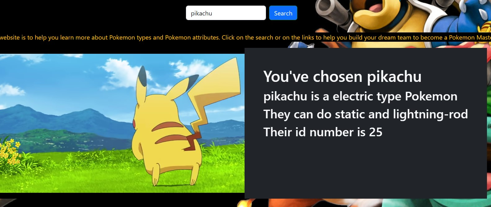
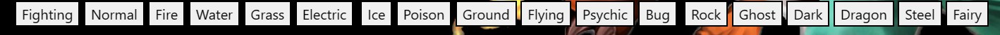
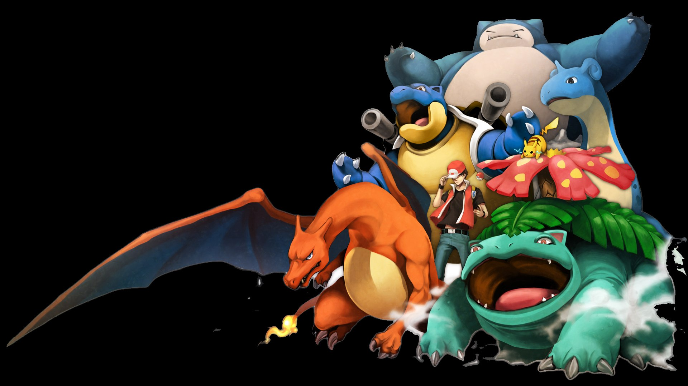

# Pokemon-info-dump

## Table of Content
- [Description](#description)
- [Header](#header)
- [Search-Bar](#search-bar)
- [Types-of-Pokemon](#types-of-pokemon)

## Description
Group Members: Kyle Phillips, Sam Craig, and Justin Moran.
We were tasked with combing two seperate APIs into one website and having them work together.
Our original concept wasn’t suported by the provided APIs, so we pivited to a different idea:
Pokemon and YouTube.

We crafted a website that pulled information about specified Pokemon through the beloved
Pokemon API while also searching for a YouTube video featuring the same searched Pokemon.
The YouTube video player is imbedded in the site.

Additionally, we have buttons for each Pokemon type. If you click on one of these buttons,
it will change the embedded YouTube video into a video where a content creator presents
what they believe are the 10 strongest Pokemon of that type.

## Header 
Here is the logo we use at the top of our page for a Title/Header.

## Search-Bar
This is a picture of the search bar that will bring you info and video of the pokemon you type in.

## Types-of-Pokemon
Here is a picture of the buttons that when clicked on it brings up a video and shows you the top pokemon in that type.

## Background Image 

